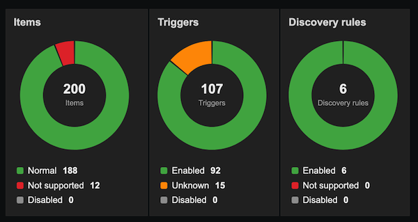
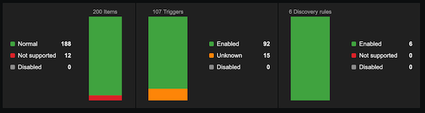
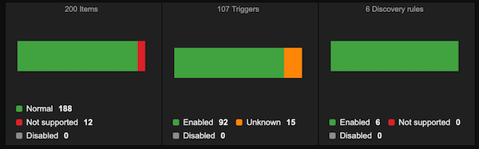

# Host Monitoring Entities — Zabbix Widget

A Zabbix 7.0 dashboard widget that shows the count of **Items**, **Triggers**, or **Discovery rules** by state for a selected host, rendered as a pie chart, horizontal bar, or vertical bar.

## Screenshots

 | Pie chart |
|:---:|
|  |

| Vertical bar | Horizontal bar | 
|:---:|:---:|
|  |  | 

## Features

- **Three sources:** Items · Triggers · Discovery rules
- **Three chart types:** Pie chart · Horizontal bar · Vertical bar
- **Legend positioning:** None · Top · Bottom · Left · Right
- **Optional total count label** in the chart (source name + total)
- **Hover tooltips** on every chart segment
- **Click-through links** to the Zabbix configuration page, filtered by host and state
- **Entry animation** (cubic ease-out, 550 ms); skipped on resize
- **Template dashboard support:** host field auto-resolves to the dashboard host

## States

| Source | States |
|--------|--------|
| Items | Normal · Not supported · Disabled |
| Triggers | Enabled · Unknown · Disabled |
| Discovery rules | Enabled · Not supported · Disabled |

## Installation

1. Copy the `zabbix-widget-host-monitored-entities/` directory to `<zabbix_root>/modules/`
2. Go to **Administration → General → Modules** and click **Scan directory**
3. Enable the **Host monitoring entities** module
4. Add the widget to any host or template dashboard

## Requirements

- Zabbix 7.0+
- PHP 8.0+

## Configuration options

| Option | Description |
|--------|-------------|
| Source | Entity type to display |
| Host | Target host (optional in template dashboards) |
| Graph type | Pie chart / Horizontal bar / Vertical bar |
| Show total count | Display total + source name in the chart |
| Show legend | Legend position: None / Top / Bottom / Left / Right |
| Enable links | Click segments to open the filtered configuration list |
